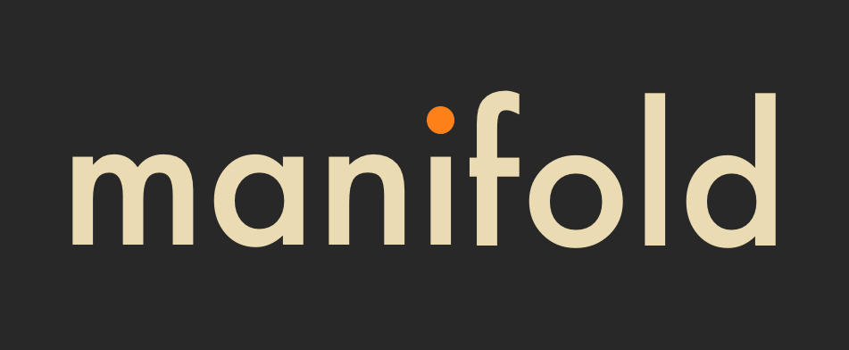

<p align="center">
  
</p>

#                                                                                                                                                                                                                                                                                                                                                            

<p align="center">
A general purpose highlighting library 
</p>

## Overview

`manifold` is a general-purpose highlighting engine for highlighting common objects such as dates, numbers, keywords,
and UUIDs. It works by surrounding these items with ANSI color codes, enabling them to be displayed in color in the
terminal.

If you're just interested in a cli for highlighting text, see [`tailspin`](https://github.com/bensadeh/tailspin).

## Supported Highlight Groups

- Custom keywords
- Numbers
- UUIDs
- URLs
- IPs (v4 & v6)
- Dates
- Quotes
- Unix File Paths
- Key Value pairs
- Pointer Addresses
- Unix Processes

## Getting Started

### From default

The quickest way to get starting with manifold is using the default constructor. It will provide you with a highlighter
with most of the highlighters enabled and sensible ordering.

```rust
use inlet_manifold::*;

fn main() {
    let highlighter = Highlighter::default();

    let input = "Hello 42 world".to_string();
    let output = highlighter.apply(input);

    println!("{}", input);  // "Hello 42 world"
    println!("{}", output); // "Hello \u{1b}[36m42\u{1b}[0m world!"
}
```

> [!NOTE]
> Keep in mind that colors, ordering and new highlight groups might change between versions. To ensure a more
> deterministic behavior, use the **builder pattern**.

### Builder pattern

Use the builder pattern to specify both styling and ordering of the highlighters.

```rust 
use inlet_manifold::*;

fn main() {
    let highlighter_result = Highlighter::builder()
        .with_number_highlighter(NumberConfig {
            number: Style {
                fg: Some(Color::Cyan),
                ..Style::default()
            },
        })
        .with_quote_highlighter(QuoteConfig {
            quotes_token: '"',
            color: Style {
                fg: Some(Color::Yellow),
                ..Style::default()
            },
        })
        .with_uuid_highlighter(UuidConfig::default())
        .build();

    let highlighter = match highlighter_result {
        Ok(h) => h,
        Err(_) => panic!("Failed to build highlighter"),
    };

    let input = "Hello 42 world".to_string();
    let output = highlighter.apply(input);

    println!("{}", input);  // "Hello 42 world"
    println!("{}", output); // "Hello \u{1b}[36m42\u{1b}[0m world!"
}
```

> [!IMPORTANT]  
> The order of the highlighting determines the precedence of each item. Once an item is highlighted, it will not be
> overwritten by a subsequent highlighter, even if it matches the pattern.
