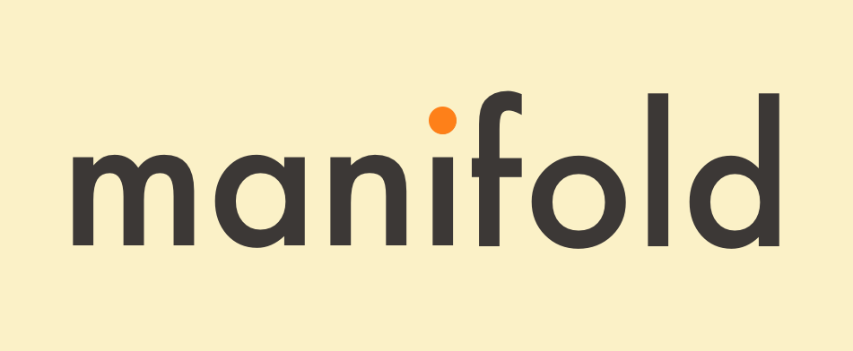

<p align="center">
  
</p>

#                                                                                                                                                                                                                                                                                                                                                                    

<p align="center">
<code>manifold</code> is the highlighting crate powering <code><a href="https://github.com/bensadeh/tailspin">tailspin</a></code>
</p>

## Overview

`manifold` is a general-purpose highlighting engine for highlighting common objects such as dates, numbers, keywords,
UUIDs and more. It works by surrounding these items with ANSI color codes, enabling them to be displayed in color in the
terminal.

`manifold` is the highlighting engine powering [`tailspin`](https://github.com/bensadeh/tailspin).

## Usage

### Getting started

Add the following to your `Cargo.toml`:

```toml
[dependencies]
inlet_manifold = "0.1.0"
```

### Create highlighter from default

The quickest way to get starting with manifold is using the default constructor. It will provide you with a highlighter
with most of the highlighters enabled and sensible ordering and defaults.

Note that colors, ordering and highlight groups might change between versions. To ensure a more deterministic behavior,
use the **builder pattern**.

```rust
use inlet_manifold::*;

let highlighter = Highlighter::default();

let input = "Hello 42 world".to_string();
let output = highlighter.apply(input);

println!("{}", input);  // "Hello 42 world"
println!("{}", output); // "Hello \u{1b}[36m42\u{1b}[0m world!"
```

### Create highlighter with builder pattern

Use the builder pattern to specify both styling and ordering of the highlighters. The order in which each highlighter is
added is significant. `manifold` will apply the highlighters in the order they were added.

Once an item is highlighted, it will not be overwritten by a subsequent highlighter.

```rust 
use inlet_manifold::*;

let highlighter_result = Highlighter::builder()
    .with_number_highlighter(NumberConfig {
        number: Style {
            fg: Some(Color::Cyan),
            ..Style::default()
        },
    })
    .with_quote_highlighter(QuoteConfig {
        quotes_token: '"',
        color: Style {
            fg: Some(Color::Yellow),
            ..Style::default()
        },
    })
    .with_uuid_highlighter(UuidConfig::default())
    .build();

// Building highlighters might fail if the regexes inside fails to compile
let highlighter = match highlighter_result {
    Ok(h) => h,
    Err(_) => panic!("Failed to build highlighter"),
};

let input = "Hello 42 world".to_string();
let output = highlighter.apply(input);

println!("{}", input);  // "Hello 42 world"
println!("{}", output); // "Hello \u{1b}[36m42\u{1b}[0m world!"
```

